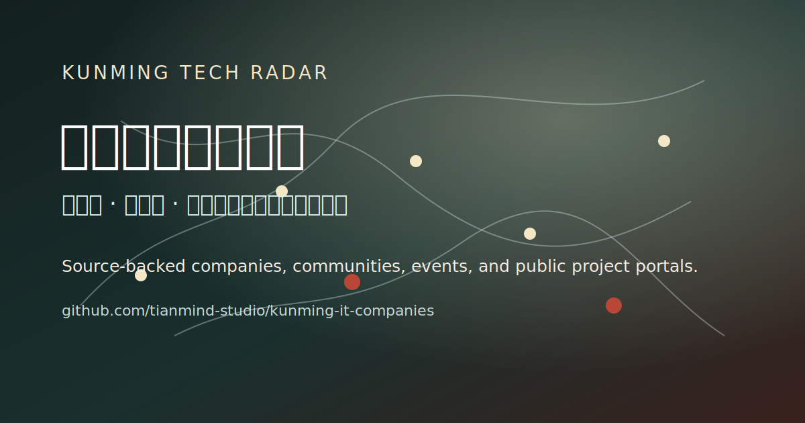

# 昆明技术机会雷达 / Kunming Tech Radar

[](https://github.com/tianmind-studio/kunming-it-companies/actions/workflows/validate.yml)

**项目一句话介绍：**昆明技术机会雷达是一个整理昆明/云南技术公司、社群活动和数字化项目公开线索的开源数据项目。

**One-line intro:** Kunming Tech Radar is an open, source-backed dataset of tech companies, communities, events, and digital-project leads in Kunming and Yunnan.

这个仓库整理昆明及云南范围内的技术公司、IT 公司、软件团队、AI / 大数据 / 系统集成 / 数字化服务相关机构，以及技术活动、社群和政府数字化项目查询入口。

它不是公司黄页、招聘中介或公司排名，也不做就业承诺和商业背书。项目的核心价值是把散落在官网、招聘平台、政府公告、公众号、PDF 和历史清单里的公开线索，整理成可以检索、可以复核、可以持续维护的开放数据。

## 30 秒快速入口

| 你想做什么 | 入口 |
| --- | --- |
| 搜索公司 / 方向 / 区县 / 核验状态 | [国内静态站首页](https://kunming.tianmind.com/) |
| 下载数据 | [JSON](data/companies.json) / [CSV](data/companies.csv) |
| 看数据是否可信 | [数据质量报告](docs/data-quality-report.md) / [数据标准](docs/data-standard.md) |
| 看哪些记录最需要复核 | [数据清理计划](docs/data-cleanup-plan.md) |
| 查看本次数据变更 | [数据变更摘要](docs/data-change-summary.md) |
| 提交公开线索 | [提交线索页](submit.html) / [GitHub Issue](https://github.com/tianmind-studio/kunming-it-companies/issues/new/choose) |
| 加入本地复核社群 | [联系 / 本地社群](#联系--本地社群) |
| 本地运行与部署 | [本地预览](#国内站与-github-的分工) / [部署说明](docs/domestic-site-deploy.md) |
| 复用或引用数据 | [复用、引用与更正](#复用引用与更正) |
| 使用公开介绍文字 | [公开分享短介绍](docs/promotion.md) |

面向普通用户的主入口建议部署在国内可访问域名：

- 国内主入口：<https://kunming.tianmind.com/>（待正式部署）
- 备用入口：<https://tianmind-studio.github.io/kunming-it-companies/>

如果你是在搜索“昆明 IT 公司”“昆明软件公司”“昆明程序员”“昆明 AI 公司”“云南软件公司”“云南数字化项目”或 “Kunming tech companies”，普通用户建议先用国内站点；开发者和数据贡献者可以继续使用本仓库。

## 这个项目帮谁解决什么问题

### 学生

- 找到昆明/云南有哪些真正和技术相关的公司。
- 在投实习、做课程项目、找毕业设计方向前，先了解本地行业分布。
- 看见软件开发、系统集成、AI / 大数据、农业数字化、医疗信息化、文旅科技等方向，不只盯着一线城市。

### 开发者

- 找本地工作、合作方、技术团队和行业入口。
- 快速判断一家公司是官网已核验、官方页核验，还是社区待复核。
- 发现本地技术社群、活动和可能的项目来源。

### 自由职业者 / 创业者

- 从公开信息里发现客户线索、外包方向和产业数字化机会。
- 看到哪些传统行业正在被软件、数据、AI、物联网、系统集成改造。
- 把“昆明有没有技术机会”变成一张可维护的本地雷达图。

### 企业 / 机构

- 提高被本地学生、开发者和技术服务者发现的概率。
- 补充官网、招聘页、技术博客、开源主页、活动页等公开入口。
- 用透明来源让本地生态更容易被看见。

## 当前数据概览

当前主数据源：[`data/companies.json`](data/companies.json)。

| 指标 | 当前状态 |
| --- | --- |
| 已收录公司 / 机构 | 73 |
| 官网已核验 | 24 |
| 官方页核验 | 2 |
| 社区待复核 | 47 |
| 弱来源记录 | 43 |
| 缺区县记录 | 39 |
| 强来源占比 | 36% |
| 已导出 CSV | [`data/companies.csv`](data/companies.csv) |
| 来源种子池 | 45 条公开来源入口，覆盖 9 个方向 × 每方向至少 5 条 |
| 社群 / 活动入口 | [`data/communities.csv`](data/communities.csv)、[`data/events.csv`](data/events.csv) |
| 政府项目入口 | [`data/gov-projects.csv`](data/gov-projects.csv) |
| 覆盖区域 | 五华区、盘龙区、官渡区、西山区、呈贡区、高新区、安宁 / 其他、待补区域 |
| 覆盖方向 | 软件开发 / 外包、系统集成 / 政企信息化、AI / 大数据、农业数字化、医疗信息化、文旅科技、金融科技、网络安全、通信 / ICT |

这些数字应和 [`docs/data-quality-report.md`](docs/data-quality-report.md) 保持一致。更新 `data/companies.json` 后请运行 `npm run generate:data-quality`，避免 README、报告和页面统计互相打架。

说明：`社区待复核`、`弱来源` 和 `缺区县` 不是项目缺陷标签，而是开放协作入口。它们表示这些记录仍需要本地开发者、学生、企业或维护者补充公开官网、官方页、区县来源、政府项目页、公众号文章或招聘页。`来源种子池` 只用于发现候选，不代表存在岗位或合作机会。



## 快速浏览入口

- [国内静态站首页](https://kunming.tianmind.com/)：面向学生、求职者、自由职业者、企业和非技术用户，搜索、筛选、下载和提交线索都在页面内完成。
- [网页使用指南](https://kunming.tianmind.com/guides.html)：把角色用法、搜索指南、数据标准、复用和更正规则做成国内站网页入口。
- [提交线索页](submit.html)：不会 GitHub 也可以直接填在线表单、复制模板或加微信提交公开来源。
- [GitHub Pages 备用入口](https://tianmind-studio.github.io/kunming-it-companies/)：同一套静态页面的备份访问地址。
- [公司索引 COMPANIES.md](COMPANIES.md)：适合在 GitHub 内直接阅读和搜索。
- [按角色使用](docs/use-cases.md)：学生、开发者、自由职业者、创业者、企业和外地读者怎么用。
- [搜索指南](docs/search-guide.md)：把常见搜索词映射到真实数据、页面和来源边界。
- [结构化主数据 data/companies.json](data/companies.json)：维护者优先修改这里。
- [CSV 导出 data/companies.csv](data/companies.csv)：由 JSON 自动导出，方便表格工具打开。
- [项目简介](docs/project-brief.md)：一页看懂项目用途、数据范围和贡献方式。
- [数据标准](docs/data-standard.md)：收录边界、字段解释、核验规则。
- [数据清理计划](docs/data-cleanup-plan.md)：列出当前最值得人工复核的记录和建议复核方向。
- [数据变更摘要](docs/data-change-summary.md)：对比上一版本数据，方便 PR review。
- [来源补强手册](docs/source-research-playbook.md)：每个方向至少 5 条公开来源入口，以及如何避免编造岗位。
- [为什么要做昆明技术机会雷达](docs/why-kunming-tech-radar.md)：项目背景和使用场景。
- [贡献指南](CONTRIBUTING.md)：开发者如何补充公司、修正过期信息。
- [国内站部署说明](docs/domestic-site-deploy.md)：如何把静态站部署到 `kunming.tianmind.com`。

## 数据源策略

为避免多份数据互相打架，当前公司数据采用以下策略：

1. `data/companies.json` 是主数据源。
2. `scripts/generate-companies-md.mjs` 从 JSON 生成 `COMPANIES.md`。
3. `scripts/export-companies-csv.mjs` 从 JSON 导出 `data/companies.csv`。
4. 不手工维护 `COMPANIES.md` 和 `companies.csv` 里的公司正文。

公司记录必须保留这些可信度字段：

| 字段 | 用途 |
| --- | --- |
| `source_url` / `source_urls` | 原始公开来源和补充来源 |
| `source_type` | 官网、官方页、政府名单、招聘平台、社区清单等来源类型 |
| `verification_status` | `verified` / `official_page` / `community_pending` / `outdated` / `unknown` |
| `last_checked` | 最近核验日期，格式为 `YYYY-MM-DD` |
| `confidence_score` | 来源强度 1-5 分，不是公司评分 |
| `opportunities` | 检索提示，不代表正在招聘、外包或合作 |
| `suitable_for_*` | 适合谁阅读这条记录，不是业务承诺 |

常用命令：

```bash
npm run generate:companies
npm run export:csv
npm run generate:data-quality
npm run data:diff
npm run validate:data
npm run validate
```

本项目不自动抓取公司信息。新增数据必须来自公开来源，并保留原始链接。

补来源时先看 [`data/source-leads.csv`](data/source-leads.csv)：它是 9 个方向的公开来源种子池。注意：招聘平台入口只证明“可以继续查”，不证明“正在招聘”；没有具体公开招聘主页时，不要把 `opportunities` 写成 `internship` 或 `hiring`。

## 怎么判断信息可信度

| 字段 | 怎么看 |
| --- | --- |
| `source_url` | 最重要的原始来源。复用或判断前先打开它。 |
| `source_type` | 区分官网、官方页、政府名单、招聘平台、媒体数据库或社区清单。 |
| `verification_status` | `verified` / `official_page` 更强；`community_pending` 表示还需要复核。 |
| `last_checked` | 最近核验日期。日期越久，越需要重新打开来源确认。 |
| `confidence_score` | 1-5 分的来源强度，不是公司好坏评分。 |
| `opportunities` | 阅读提示，不代表正在招聘、正在外包或愿意合作。 |

## 当前最需要的贡献

如果你想让这份数据更有用，优先补这几类信息：

1. 给 `community_pending` 公司补官网、官方主页或官方招聘页。
2. 给区域为空的记录补五华区、盘龙区、官渡区、西山区、呈贡区、高新区等区县信息。
3. 给弱来源记录补第二个公开来源，尤其是政府名单、旧社区清单和招聘平台候选。
4. 补充本地高校技术社团、开发者活动、园区活动和政府数字化项目的公开页面。
5. 报告过期官网、失效来源、重复公司或不符合收录边界的记录。

项目宁愿慢一点，也不把没有公开来源的信息写成确定事实。

当前最适合本地开发者参与的是复核队列：47 条 `community_pending`、43 条弱来源和 39 条缺区县记录已经集中列在 [`docs/data-cleanup-plan.md`](docs/data-cleanup-plan.md)。提交公开来源就是对项目最直接的贡献。

## 国内站与 GitHub 的分工

本项目按这个分工维护：

1. `data/companies.json`、CSV、脚本和提交记录保留在 GitHub，作为开源底座。
2. `kunming.tianmind.com` 作为普通用户主入口，承载搜索、筛选、查看、下载和低门槛提交。
3. GitHub Pages 只是同一套静态页面的备用入口，不再作为唯一入口。

仓库根目录已经包含一个可直接静态部署的页面：

- `index.html`
- `submit.html`
- `styles.css`
- `script.js`
- `submit.js`
- `data/companies.json`

它使用纯 HTML + CSS + JS，不需要数据库、登录系统或复杂构建工具。页面现在不只展示公司卡片，也会读取：

- `data/source-leads.csv`：按方向汇总公开来源种子。
- `data/communities.csv`：展示本地社群、组织和试运行小群入口。
- `data/events.csv`：展示技术活动和讲座来源入口。
- `data/gov-projects.csv`：展示政府数字化项目查询入口。

本地预览：

```bash
npm run serve
```

然后打开：

```text
http://127.0.0.1:4178
```

构建国内静态站：

```bash
npm run build:site
```

输出目录：

```text
dist/
```

部署准备见：[`docs/domestic-site-deploy.md`](docs/domestic-site-deploy.md)。

部署到 GitHub Pages 备用入口：

1. 打开 GitHub 仓库 Settings。
2. 进入 Pages。
3. Source 选择 `Deploy from a branch`。
4. Branch 选择 `main`，目录选择 `/root`。
5. 保存后等待 GitHub Pages 构建完成。

## 如何贡献

### 我只知道一个公司，怎么提交？

不会 GitHub 的用户优先打开 [`submit.html`](submit.html)，直接填写在线表单；也可以复制模板后通过维护者微信提交公开来源。

会 GitHub 的用户可以打开 Issue，选择 `Add company` 模板，填公司名、城市/区县、官网或公开主页、主要方向、信息来源。

### 我发现信息过期，怎么反馈？

打开 Issue，选择 `Report outdated info` 模板，说明哪家公司、哪里过期、你看到的新来源是什么。

### 我是公司负责人，怎么补充官网 / 招聘页？

打开 Issue，选择 `Update company` 模板，补充：

- 官网
- 官方招聘页
- 官方公众号文章
- 技术博客 / 开源主页
- 公司所在区县
- 主要技术方向

为了保护项目可信度，请尽量提供公开页面；不要提交第三方未经授权的私人微信、私人手机号或聊天截图。

### 我会 GitHub，怎么直接改？

1. 修改 `data/companies.json`。
2. 运行：

```bash
npm run generate:companies
npm run export:csv
npm run generate:data-quality
npm run validate
```

3. 提交 PR，并在说明里写明来源。

## 不收录什么

- 第三方未经授权的私人手机号、私人微信、私人聊天记录（维护者主动公开的项目 / 社群联系方式除外）。
- 未经核实的负面爆料。
- 无法公开验证的薪资、裁员、加班信息。
- “保证就业”“内部机会”“资源保真”等无法验证的承诺。
- 与技术、数字化、软件、数据、系统集成、研发团队无明显关系的普通商贸信息。

## 免责声明

- 本项目只整理公开信息，不保证信息完整、实时或绝对准确。
- 所有公司、岗位、活动、项目状态都可能变化，请以原始来源为准。
- 本项目不提供就业担保、商业背书、投资建议或招聘中介服务。
- `适合学生 / 求职者 / 自由职业者 / 创业者` 只是阅读和检索提示，不代表该公司正在招聘或愿意合作。
- 如果你发现信息错误、过期或不适合公开展示，请提交 Issue 或 PR 修正。

## 社区试运行

我正在做一个昆明 / 云南本地技术社群，目前先小规模试运行，用来收集公开来源、修正过期记录和复核待核验公司。

这个入口不是招聘中介，也不做公司背书，主要用于：

- 补充昆明/云南技术公司、官网、招聘主页和活动线索。
- 交流本地学生实习、项目展示、开发者合作和数字化服务机会。
- 帮忙复核 `community_pending` 记录，减少过期和错误信息。

为了保护隐私，仓库里不会公开群二维码、他人个人联系方式或聊天截图。想参与复核或补充线索，普通用户可以先通过 [`submit.html`](submit.html) 复制模板并加微信提交；开发者可以使用 GitHub Issue 模板提交公开来源。

## 联系 / 本地社群

如果你是昆明或云南的开发者、学生、创业者、企业负责人，欢迎通过微信联系我，也可以申请加入本地技术社群：

微信号：`beizhushaonlan`


添加时请备注：`昆明技术机会雷达`。

## 复用、引用与更正

- 想转载、引用或二次整理本项目，请先阅读 [`docs/reuse-and-citation.md`](docs/reuse-and-citation.md)。
- 发现隐私信息、错误记录、过期链接或不适合公开展示的内容，请按 [`docs/takedown-and-correction.md`](docs/takedown-and-correction.md) 提交更正。
- 参与讨论和复核时，请遵守 [`docs/community-guidelines.md`](docs/community-guidelines.md)。

## License

代码采用 MIT License。数据内容用于公开协作和非商业研究参考；转载或二次整理时请保留来源链接和核验日期。
